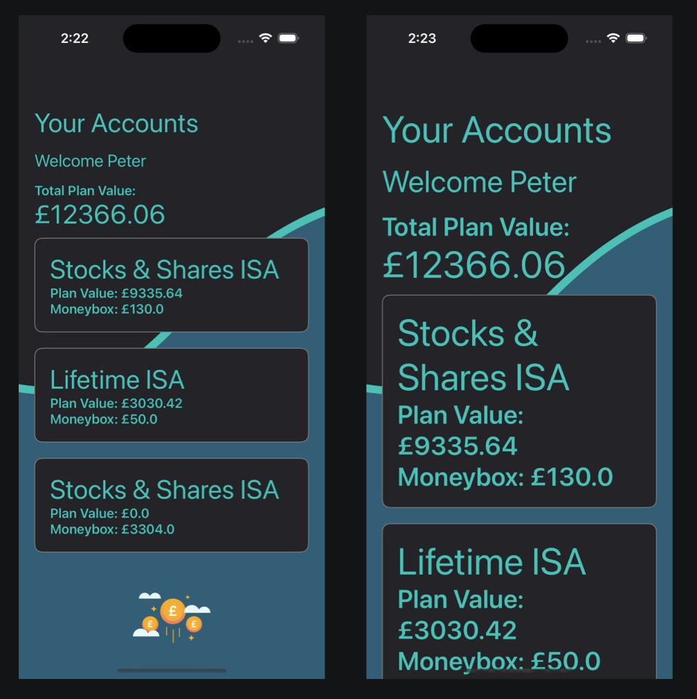
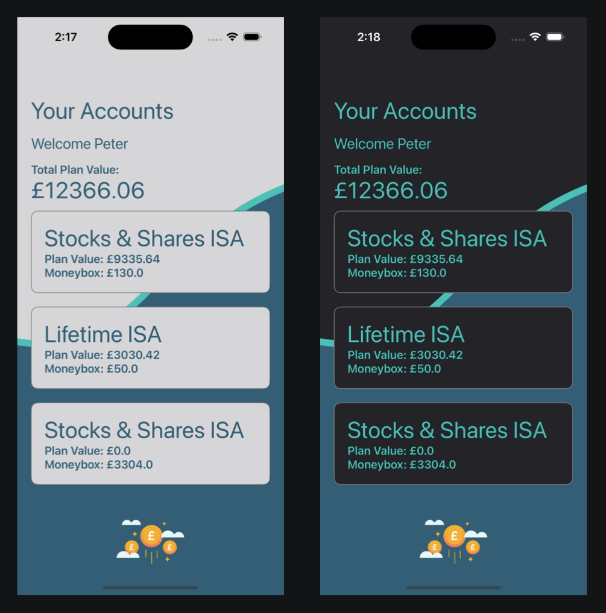

# Moneybox Tech Task

The following describes my approach to the Moneybox Tech Task.

## Design

### Motivation
In terms of design, I started in sketch and wanted to use some of the Moneybox core colours such as teal. I wanted to give the app a bit of animation but also something that would sutbly suggest money going up in value. What I came up with was a bezier curve that gives the impression of a stock going up over time, starting lower and going higher.

### Prototype in Sketch

### Animation
Note the the animation is much smoother in app compared to GIF format.

## Architecture

For architecture I opted to use a MVVM+C pattern as I really like the separation of concers. I also really like the use of Combine so that we can set up bindings between view models and the view itself. I've made a lot of use of CurrentValueSubjects for when a View needs to be informed of a state change on the view model and I think these publishers are a fantastic way of achieving that. Coordinators allow for us to integrate screens anywhere in our app rather than it being a coupled flow to X->Y->Z, where we might sometimes want to go to X->Z and coordinators allow for this flow.

## Accessibility Feature
For accessibility I would normally consider a wide range of options such as ensuring that Voice Over is making the correct announcements. Whether that is when navigating elements on the screen to announcements such as the page/request failed to load etc..

What I opted to go with in the interest of time was the ability to support large text size, so the application will respect the users text size accessibility settings and repond to these changes accordingly.

## Unit Testing
In my opinion ideally the view would have very little logic inside it and the bulk of the logic would remain in the view models. That way we have no reliance on a UI based framework such as UIKit or SwiftUI. Out View Models would remain agnostic of the framework being used.
It's important to make use of protocols so that we can mock our dependencies that normally perform effects out of reach on external dependencies.
For testing the UI itself we can make use of actual UI Tests to check for the presence of UI elements using accessibility identifiers.

## Bonus Feature - Dark Mode
As a bonus, I've added both light and dark mode to the app.

## What I'd do with more time
### Dependence on Networking Swift Package
I dislike how coupled the app is with the Networking module itself, ideally my app should be agnostic of the networking layer under the hood. So with this, I would recommend to create a networking layer local to my application, it can still have functions such as login and fetchUserAccounts but the underlying system used for networking should not be my app's concern. This has benefits such as I don't need to change my API connections to my local networking layer if say down the line I choose to not use the Network package anymore, the API from my side stays the same but the private internals could change to something like Alamo Fire for example.

### No Token Refreshing
I didn't have time to implement a token refreshing mechanism so following my previous point about refactoring networking, I would also allow this to be achieved. Something along the lines of an auth manager that will determine if we are OK to refresh a token and then make the original request and if not, we can inform the user they need to be logged in again and navigate them back to the Login screen.
